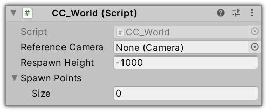

# SDK Components

## CC_World

Each world requires this component.

**Reference Camera:** The camera used to configure the post-processing effects of your world.
Assign to this field the camera where you have added the _Post-process Volume_ and
the _Post-process Layer_ components.

**Respawn Height:** If an avatar falls below the ground plane, it will respawn automatically once it falls below the specified height.

**Spawn Points:** The spawn points used to place the avatar in the world. The actual spawn point is
randomly chosen.

## CC_Grabbable

Add this component to objects you want to be able to be picked-up.