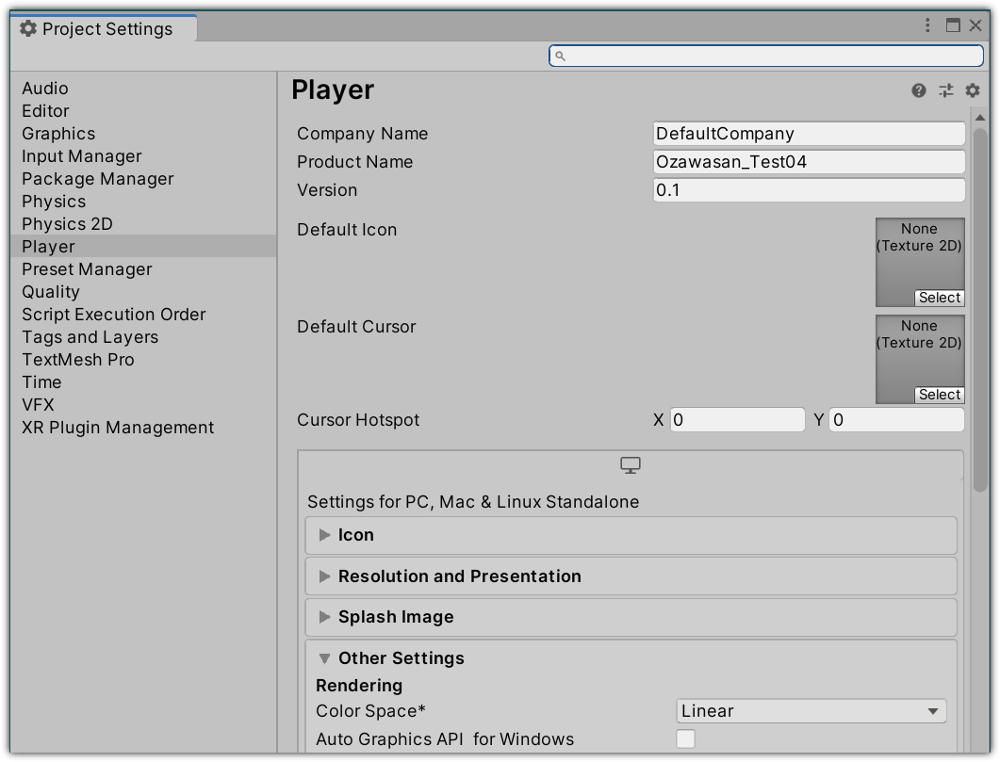

# SDKのセットアップ

CCSDKのUnity Package ManagerパッケージはGithubよりダウンロードできます。

SDKの利用にはGitが必要となるので、 [こちらから](http://git-scm.com/)ダウンロードしてください。

SDKをインストールするには、`manifest.json`ファイルに次の行を追加します。

    "com.dmm.vrlab.ccsdk": "https://github.com/dmm-com/vrlab-ccsdk.git#v1.1.0",

## プロジェクトテンプレート

ワールド作成のテンプレートとして利用できるプロジェクトを用意いたしましたので、ご活用ください。

1. [こちらより](../files/vrlab-ccsdk-template.zip) zipファイルをダウンロードします。
2. プロジェクトのための新しいフォルダを作成し、その中に解凍したファイルを入れてください。
3. Unity Hubを起動し、プロジェクト一覧に新しく作成したフォルダを追加します。
4. 新しいプロジェクトを開くと、UnityがSDKをそのプロジェクトにインポートします。
5. あなただけのワールドを作りましょう！

テンプレートプロジェクトを使用しない場合は、必ず以下に示すようにレイヤーを構成してください。

さらに、プロジェクトのカラースペースを_Linear_にしてください、

