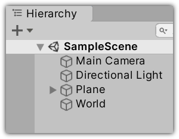
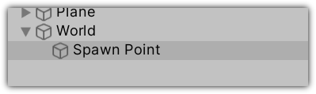
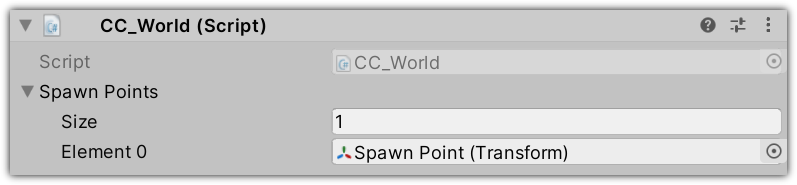
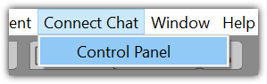
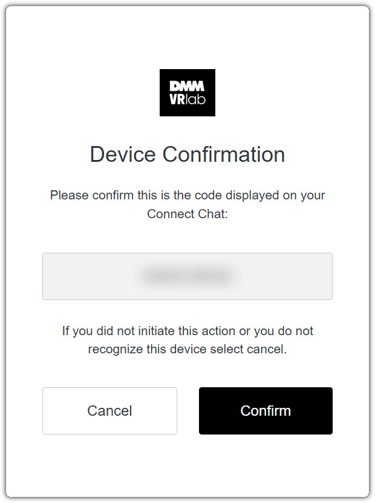
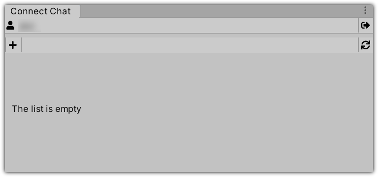
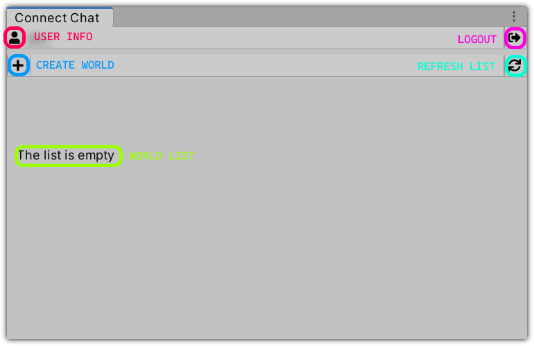
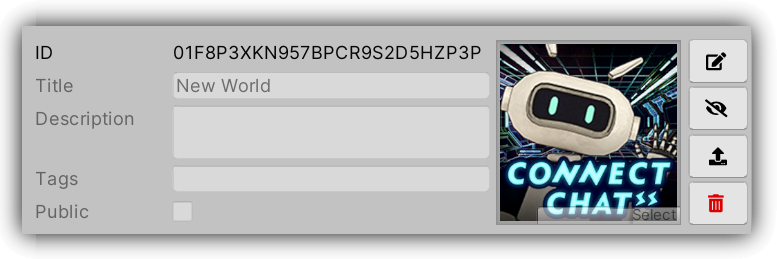
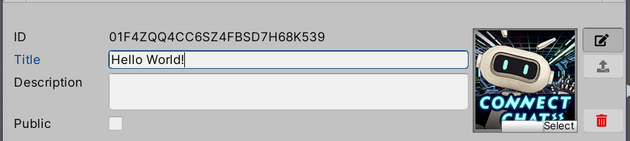
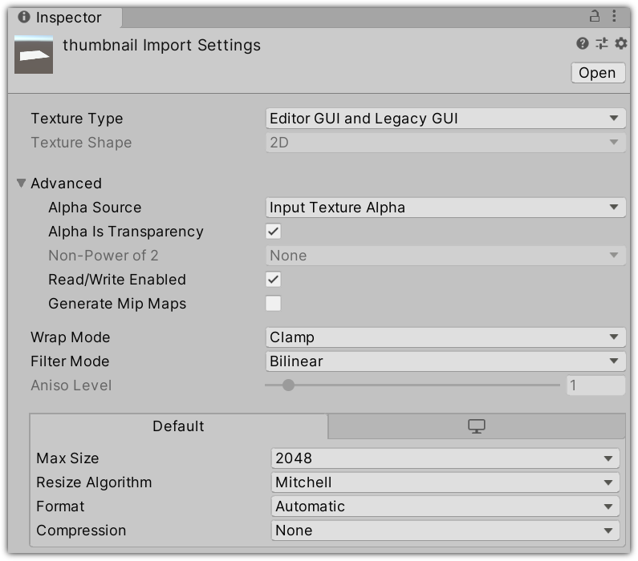

# はじめてのワールド作成

新しいワールドの作成は非常に簡単です：

1. ワールドに使用したいコンテンツが入ったシーンを作成し、セットアップします。
2. [DMM VR Connect](https://connect.vrlab.dmm.com) アカウントにログインします。
3. ワールド一覧に新しいワールドを追加してください。
4. シーンをアップロードします。
5. ワールドをパブリッシュします。

## ステップ1：シーンの作成とセットアップ

新しいシーンを作成し、ワールドに使いたいコンテンツを配置してください。

次に、空の_GameObject_を置き、 _CC World_コンポーネントを追加します。

空の_GameObject_を置き、シーンにスポーンポイントを追加します。

そして「_CC World_」のスポーンポイント一覧に追加してください。

＊シーンに対応していないUnityのコンポーネント・シェーダーがあるのでご注意ください。対応コンポーネント一覧は [こちら](05-supported-components.md#対応コンポーネント) 、対応シェーダー一覧は [こちら](05-supported-components.md#対応シェーダー) からご確認いただけます。

## ステップ2：DMM VR Connectへのログイン

1. 「_Connect Chat_」メニューよりコントロールパネルを開きます。

    

2. コントロールパネルのウィンドウが開いたら、「_Login_」ボタンを押してご利用の [DMM VR Connect](https://connect.vrlab.dmm.com) アカウントにログインしてください。

    

3. ログイン後、開いたブラウザウィンドウの「_Confirm_」ボタンを押してUnityに戻ってください。

    

4. ログイン完了後、コントロールパネルにアップロードしたワールドの一覧が現れます。

    

コントロールパネルはワールド一覧に加え、ユーザーにとって有益な情報や操作がいくつかあります。

## ステップ3：新規ワールドの追加

「+」ボタンを押す事によって新しいワールドを追加してください。するとワールド一覧が更新され、新規ワールドが一覧から見れるようになります。

**ID:** ワールドの内部ID

**Title:** ワールド選択画面に現れるワールドの名称

**Description:** ワールドの説明文

**Public:** ワールドが誰にでも利用できるか、あなた自身にしか使えないかの表記（プライベートに設定していても同じインスタンスに他のユーザーを招待することは可能です）

右記の画像はワールドのサムネイルです。サムネイルは256 x 256のテクスチャで、ワールド選択画面にてワールドの名称と一緒に表示されます。

画面の右端には四つのアイコンがあります:

 **Edit:** ワールドの詳細を修正できるモードをオン・オフできます。

 **Publish:** ワールドをパブリッシュし、ワールド選択画面から選べるようにします。

 **Build & Upload:** 現在選択されているシーンでワールドのアセットバンドルをビルドし、アップロードします。

 **Delete:** ワールドを削除します (一度削除したワールドは復元できません)。

### ワールド詳細の修正

「_Edit_」をクリックして詳細を修正したいワールドの「_edit mode_」をオンにしてください。

このモードからワールドの名称と説明文の修正、サムネイルの変更、ビジビリティのオン・オフが行えます。

カスタムサムネイルは256 x 256ピクセルで下記の設定でインポートしてください。

## ステップ4：アップロード

ワールドのビルドとアップロードを行うには、ビルドボタンをクリックしてください。アップロードが完了次第、ダイアログが出現します。

アップロードがうまくいかない場合（シーンに非対応コンポーネントを利用していた、等）は、コンソールのエラーメッセージを確認してください。

## ステップ5：ワールドのパブリッシュ

ワールド詳細の設定が終わり、シーンのアップロードが完了すれば、あとはパブリッシュボタンを押す事によってあなたのワールドをConnect Chatで公開できます。
