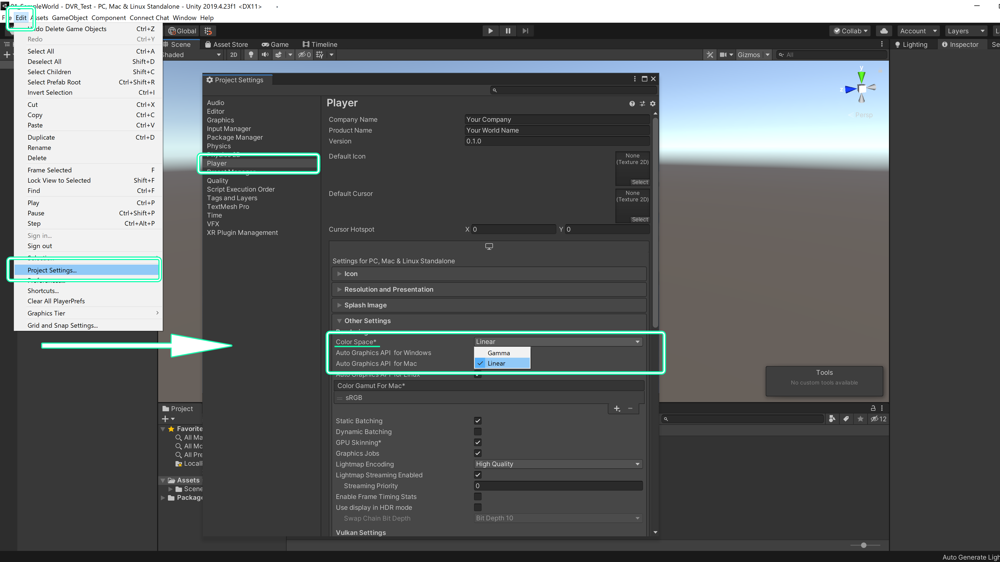

## ワールドの一般的な作り方

ここではワールドの一般的な作り方を解説します。まず、BlenderやMayaといった3DCGソフトで3Dモデルをモデリングをするか、
アセット販売サイトなどで3Dモデルを購入するなどして、ワールドを作るための3Dモデルを用意します。  
 

  

### ConnectChatのための事前準備
ConnectChat用の設定としてUnityのカラースペースの設定を行っておきましょう。  
Edit→Project Settingsと進んで、Playerから
**ColorSpaceをLinearに設定しましょう。**
事前の設定はこれだけで、テンプレートを使用する場合は設定済なので新しい設定は不要です。  
 

  

### オブジェクトのインポートと配置

3DモデルはFBXなどの形式でエクスポートし、UnityProjectのAssetsフォルダ配下に新しくオブジェクト管理用のフォルダを作成します。ここではMeshフォルダを作成しました。  
そしてエクスポートした3Dモデルをドラッグアンドドロップするなどの方法でUnity内にインポートをします。インポートができたら必要なオブジェクトをHierarchyに
ドラッグアンドドロップして、シーンに配置し、位置の調整などを行います。 
マテリアルやテクスチャの設定、ライトマップ用UVの生成などが必要な場合は同様に設定を行いましょう。  
 

  
マテリアルの生成方法はいくつか方法がありますが、ここでは3DCGソフトであらかじめ設定したマテリアルを取り出す方法を解説します。
インポートしたオブジェクトを１つ選択してInspectorのMaterialsタブを開き、下記のように設定してApplyをクリックしましょう。  
 
**Location : Use External Materials(Legacy)**  
**Naming : From Model's Material**  
 

  
自動で同階層にMaterialsフォルダが生成され、このフォルダの中にマテリアルが作成されました。この方法でマテリアルを作成する事でマテリアル名などの再設定が不要となります。  
また、複数のオブジェクトからマテリアルを取り出す場合は続いて、下記のような手順で操作をします。  
 
**①右上のSelect Presetアイコンをクリックします。  
②ポップアップするSelect PresetウインドウからSave current to…をクリックし、プリセットを保存します。  
③マテリアルを取り出したいオブジェクトをすべて選択します。  
④Select Presetウインドウから先ほど保存したプリセット「FBXImporter.preset」を選択します。  
⑤Applyをクリックします。これで複数オブジェクトからマテリアルが作成できました。**
 

  
マテリアルが作成できたら、テクスチャを割り当てます。テクスチャ画像をインポートしたらマテリアルのInspectorの該当するMapにテクスチャを割り当てます。
ここではPBR（物理ベースレンダリング）でテクスチャを作成していましたのでAlbedo/MetallicSmoothness/NormalMapの３枚の画像を割り当てました。
 

  
最後に、後にライティングをした際にライトベイクを行うオブジェクトにはLightmapUVを作成しておきましょう。必要なオブジェクトを選択してInspectorのModelタブから
Generate Lightmap UVsにチェックを入れてApplyをクリックしましょう。これで自動でLightmapUVが生成されます。
 

  
### コライダーの設定

次に床や壁、障害物などにコライダーの設定を行います。コライダーの設定はオブジェクトのInspectorからAdd Componentをクリック、Box ColliderやMesh Colliderを選択して追加します。  
これによってキャラクターがオブジェクトの上を移動したり、移動範囲を制限する壁を作ったりできます。  
 

  
### Skybox設定とライティング

次はSkyboxの設定をしましょう。Skyboxはワールドの環境光や背景を扱うことが出来ます。HDRIの画像を用意してインポートし、HDRI画像のInspectorからTexture ShapeをCubeとします。  
 

  
右クリックで新しくマテリアルを作成し、マテリアルのInspectorのShaderをSkybox>Cubemapに変更し、Cubemap(HDR)の項目に、先ほど用意したHDRI画像を割り当ててみましょう。
 

  
Lithingウインドウ（Window>Rendering>Lighting Settings）のSkybox Materialに先ほど作成したSkyboxのマテリアルを割り当てます。これでSkyboxの設定が完了です。  
必要に応じてIntensity Multiplierなどの設定で環境光の強さを設定しましょう。
 

  
次にライトの設定をしましょう。今回は既にあるDirectionalLightを使用しますが、PointLightなど他のライトを自由に配置して世界観を作る事が可能です。  
ここではColorを青味のある色に、Intensityを少し下げ、ShadowのStrengthを半分にしました。
 

  
ライトの設定が終わったら必要に応じてライトベイクを行う事によって、計算負荷を減らしワールドでより快適に遊ぶことができるようになります。  
**Bakeを行う場合は配置したライトのModeをBakedに設定し、また、Hierarchyからワールド内で動かないオブジェクトをすべて選択し、InspactorのStaticにチェックを入れます。**  
そしてLightingウインドウのLightmapping Settingsの設定を行い、Generate Lightingをクリックする
ことでライトベイクを行う事ができます。
  

  
### ポストエフェクト

必要に応じてポストエフェクトを追加してみましょう。ポストエフェクトを追加することでワールドに様々な効果を与える事ができます。ただし、計算負荷も増えてしまうため計画的に使用するようにしましょう。  
ポストエフェクトの追加はMainCameraのInspectorからAdd Componentをクリック、Post-process LayerとPost-process Volumeを追加します。  
Post-process Layerの設定はLayerをDefaultに設定しましょう。  
Post-process VolumeはIs Globalにチェック、Profile>Newと進み、Add effectから追加したいエフェクトを選びます。
ここでは例としてColor Gradingを追加し、Saturation（彩度）とContrast（コントラスト）を調整してみました。  
 

  
以上で一般的なワールド制作の手順となります。  
あなただけの素敵なワールド制作にチャレンジできましたか？  
 
次はConnectChatでの**共通設定とアップロード**を解説しますので先へ進んでみましょう。  
 
- **[共通設定とアップロード](10-tutorial-world-upload.md#共通設定とアップロード)**
