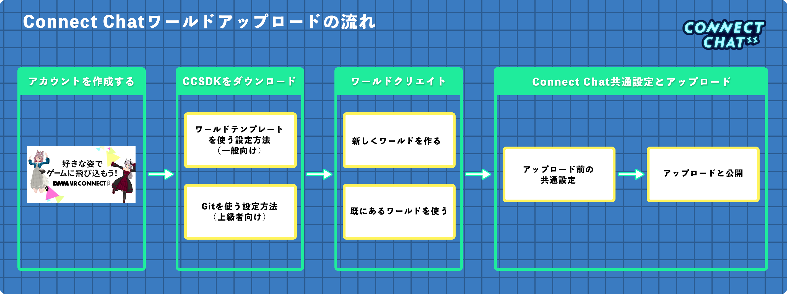

## はじめに/目次

ここでは、チュートリアル形式でConnect Chatにワールドをアップロードする方法を解説します。  
Connect Chatのワールドアップロードはとてもシンプルで、既存のワールドシーンをアップロードすることもできるためチャレンジをしてみましょう！  

### Connect Chatワールドアップロードの流れ
 

### チュートリアルもくじ

- **[アカウントの作成](07-tutorial-start.md#アカウントの作成)**
  - **[CCSDKをダウンロードしてUnityにインポート](07-tutorial-start.md#ccsdkをダウンロードしてunityにインポート)**

- **[CCSDKのダウンロード](08-tutorial-ccsdk-download.md#ccsdkのダウンロード)**
  - **[ワールドテンプレートを使うCCSDKの設定方法（一般向け）](08-tutorial-ccsdk-download.md#ワールドテンプレートを使うccsdkの設定方法_一般向け)** 
    - **[環境構築（ワールドテンプレート使用）](08-tutorial-ccsdk-download.md#環境構築_ワールドテンプレート使用)**
      - **[テンプレートをもとに新しくワールドを作る方法](08-tutorial-ccsdk-download.md#テンプレートをもとに新しくワールドを作る方法)**
      - **[既にあるワールドをテンプレートにインポートする方法](08-tutorial-ccsdk-download.md#既にあるワールドをテンプレートにインポートする方法)**
  - **[Gitを使うCCSDKの設定方法（上級者向け）](08-tutorial-ccsdk-download.md#gitを使うccsdkの設定方法_上級者向け)**
    - **[環境構築（Git使用）](08-tutorial-ccsdk-download.md#環境構築_git使用)**  

- **[ワールドの一般的な作り方](09-tutorial-world-create.md#ワールドの一般的な作り方)**
  - **[ConnectChatのための事前準備](09-tutorial-world-create.md#ConnectChatのための事前準備)**
  - **[オブジェクトのインポートと配置](09-tutorial-world-create.md#オブジェクトのインポートと配置)**
  - **[コライダーの設定](09-tutorial-world-create.md#コライダーの設定)**
  - **[Skybox設定とライティング](09-tutorial-world-create.md#skybox設定とライティング)**
  - **[ポストエフェクト](09-tutorial-world-create.md#ポストエフェクト)**

- **[共通設定とアップロード](10-tutorial-world-upload.md#共通設定とアップロード)**
  - **[ワールドアップロード前の共通設定](10-tutorial-world-upload.md#ワールドアップロード前の共通設定)**
    - **[SpawnPoint（スタート地点）の設定](10-tutorial-world-upload.md#spawnpointの設定)**
    - **[非対応のコンポーネントの削除](10-tutorial-world-upload.md#非対応のコンポーネントの削除)**
  - **[ワールドアップロードと公開_パブリッシュ](10-tutorial-world-upload.md#ワールドアップロードと公開_パブリッシュ)**
- **[追加機能](11-tutorial-additional-features.md#追加機能)**
  - **[グラバブル機能](11-tutorial-additional-features.md#グラバブル機能)**

 

### アカウントの作成

Connect ChatではDMM VR Connectのアカウントを使用してワールドを管理するため、アカウント作成がまだの方は下記URLよりアカウント作成を行いましょう。
また、DMM VR Connectに登録した好きなVRMアバターの姿でConnect Chatを遊ぶことができます。  
 
**DMM VR Connect : https://connect.vrlab.dmm.com/**
  

### CCSDKをダウンロードしてUnityにインポート

CCSDK（Connect ChatカスタムワールドSDK）の導入方法は一般向けと上級者向けの２つの方法が用意されています。
それぞれ詳しく解説をしますので、選びたい方法をクリックして先へ進んでください。

**:warning: Connect ChatはUnity 2019.4.29を使用しています。 新しくワールドを作成する場合は、必ず上記のバージョンのUnityを用意しましょう。**  
Unityの対応するバージョンのインストール方法は
**[こちら](../Japanese/02-supported-unity-version.md#対応Unityバージョン)**
で詳細の解説を行っています。
 

- **[ワールドテンプレートを使うCCSDKの設定方法（一般向け）](08-tutorial-ccsdk-download.md#ワールドテンプレートを使うccsdkの設定方法_一般向け)**
- **[Gitを使うCCSDKの設定方法（上級者向け）](08-tutorial-ccsdk-download.md#gitを使うccsdkの設定方法_上級者向け)**
